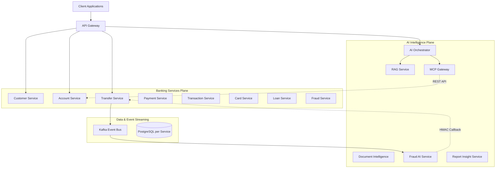

# Enterprise Banking AI Platform Architecture

This document provides a comprehensive overview of the architecture of the Enterprise Banking AI Platform.

## 1. High-Level Architecture

The system is designed with a clear separation of concerns, divided into two primary planes:
- **Banking Services Plane**: Traditional, transactional microservices handling core banking capabilities (accounts, transfers, payments, etc.).
- **AI Intelligence Plane**: Services dedicated to AI capabilities (RAG, multi-LLM orchestration, document intelligence) that interact with the banking plane only through controlled APIs and events.

## 2. Core Architectural Patterns

### 2.1 Database-per-Service
Every stateful service (13 in total) owns a dedicated PostgreSQL database.
- **No Shared Databases**: Services cannot query another service's database directly.
- **Schema Management**: Flyway handles all DDL operations. Hibernate is configured to `validate` only, ensuring that it never silently alters tables in production.

### 2.2 Event-Driven Architecture & Sagas
The platform leverages Apache Kafka for asynchronous communication and eventual consistency.
- **Transactional Outbox**: Used by `transfer-service` and `payment-service`. Database changes and event generation are committed in a single local transaction to an outbox table. A separate poller then publishes these to Kafka.
- **Saga Pattern**: The transfer process uses a saga to incorporate asynchronous AI fraud checks:
  1. `transfer-service` initiates a transfer (status: `PENDING_FRAUD_REVIEW`).
  2. Event published to Kafka.
  3. `fraud-ai-service` consumes the event and scores the risk.
  4. `fraud-ai-service` calls back `transfer-service` via an HMAC-signed REST endpoint to approve or reject the transfer.
- **Idempotency**: Consumers (like `transaction-service` and `notification-service`) handle duplicate events safely by deduplicating on reference IDs or event IDs.

### 2.3 Security Architecture
- **API Gateway & JWT**: All external traffic flows through the API Gateway, which enforces JWT validation. It supports both a local demo JWT issuer and a real Keycloak OAuth2 configuration.
- **Identity Propagation**: The gateway strips any incoming `X-User-Id` or `X-User-Roles` headers to prevent spoofing, and injects trusted headers downstream based on the verified JWT claims.
- **Downstream RBAC**: Downstream services use a `TrustedIdentityFilter` to reconstruct the Spring Security context, enabling strict `@PreAuthorize` rules on sensitive endpoints (e.g., loan approval).
- **Encryption at Rest**: PII (like `nationalId` in `customer-service`) is encrypted at rest using AES-256-GCM via the zero-dependency `common-crypto` module.
- **Service-to-Service Trust**: Sensitive callbacks (like the fraud saga callback) are secured using HMAC-SHA256 signatures to prevent unauthorized direct access.

### 2.4 AI Integration Guardrails
- **No Direct DB Access**: AI services do not have database credentials to banking services.
- **Read-Only Tools**: Model Context Protocol (MCP) tools exposed to the LLM (e.g., checking balance) are strictly read-only by design. No financial write is exposed as an AI tool.
- **Aggregation First**: The `report-insight-service` pre-aggregates ledger data before sending it to the LLM, structurally preventing raw transaction data from entering the prompt.
- **Circuit Breakers**: Synchronous AI calls (e.g., to RAG or MCP tools) are protected by Resilience4j circuit breakers with defined fallback behaviors.

## 3. Technology Stack

- **Language & Framework**: Java 21, Spring Boot 3.3, Spring Cloud
- **Data**: PostgreSQL 16, H2 (for tests), Flyway, Spring Data JPA
- **Messaging**: Apache Kafka, Zookeeper
- **AI/LLM**: Integrations with OpenAI, Anthropic (Claude), Google (Gemini) via HTTP clients, vector store abstraction (in-memory implementation).
- **Observability**: Micrometer, Prometheus, Zipkin (OpenTelemetry), Grafana
- **Deployment**: Docker Compose (local), Helm & Kubernetes (production), Terraform (AWS infrastructure)

## 4. Module Breakdown

### 4.1 Common Modules (`/common`)
- `common-api`: Shared DTOs and interfaces.
- `common-exception`: Standardized error handling and problem details.
- `common-security`: Downstream RBAC, JWT filters, PII masking.
- `common-events`: Kafka event envelopes.
- `common-crypto`: Zero-dependency module for AES-256-GCM encryption and HMAC-SHA256 signing.

### 4.2 Banking Services (`/banking-services`)
- `account-service`: Account management and balances.
- `customer-service`: KYC and customer profiles (with encrypted PII).
- `transfer-service`: Fund transfers with outbox and saga patterns.
- `payment-service`: Payment lifecycle with idempotency-key deduplication.
- `transaction-service`: Immutable ledger consuming events.
- `card-service`: Tokenized card issuance and lifecycle management.
- `loan-service`: Loan application, eligibility checking, and repayment.
- `fraud-service`: Deterministic business rules engine (synchronous pre-check).
- `notification-service`: Idempotent event dispatch.
- `audit-service`: Append-only audit trail with automatic data redaction.

### 4.3 AI Platform (`/ai-platform`)
- `ai-orchestrator-service`: Intent detection, RAG/MCP routing, prompt construction, and response handling.
- `mcp-gateway-service`: MCP tool registry exposing banking APIs to AI safely.
- `rag-service`: Vector store and retrieval filtering based on ACLs.
- `knowledge-service`: Document metadata and full version history lifecycle.
- `document-intelligence-service`: Keyword classification and regex-based structured field extraction.
- `fraud-ai-service`: Async Kafka consumer for transfer risk scoring.
- `report-insight-service`: Generates AI narratives from pre-aggregated account metrics.
- `ai-model-gateway`: Shared library for provider-independent LLM routing.

### 4.4 Infrastructure & Deployment
- `infrastructure/api-gateway`: Spring Cloud Gateway handling routing and JWT enforcement.
- `deployment/docker`: Complete `docker-compose.yml` for all 19 services, 13 databases, Kafka, and observability stack.
- `deployment/helm`: Kubernetes deployment manifests (`banking-microservice` chart).
- `infrastructure/terraform`: AWS provisioning scripts (VPC, EKS, RDS, MSK, etc.).
