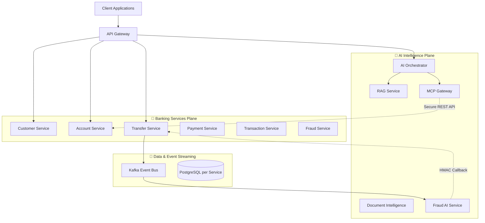

# 🏛️ Enterprise Banking AI Platform Architecture

This document provides a clear, high-level overview of how the **Enterprise Banking AI Platform** is structured. 

The architecture is built around a fundamental rule: **Keep the AI smart, but keep the banking secure.** To achieve this, the system is strictly divided into two distinct environments (planes).

---

## 1. The Two-Plane Architecture

1. **🏦 Banking Services Plane**: Traditional, transactional microservices that handle the core banking capabilities (accounts, money transfers, payments, card issuance, etc.).
2. **🧠 AI Intelligence Plane**: Specialized services that handle Generative AI routing, Retrieval-Augmented Generation (RAG), and document intelligence.

These planes *never* share a database. The AI plane can only interact with the Banking plane through tightly controlled, read-only APIs via the API Gateway.

### Architecture Diagram

---

## 2. Core Design Principles

### 📦 Database-per-Service
We strictly follow the microservices database-per-service pattern. There are 13 stateful services, and each one gets its own dedicated PostgreSQL database.
- Services cannot directly query another service's tables.
- Database schemas are strictly managed and versioned using **Flyway**.

### 📨 Event-Driven Sagas & Outbox Pattern
We use **Apache Kafka** to ensure reliability and eventual consistency across financial operations.
- **Transactional Outbox**: When a user makes a transfer, the database update and the Kafka event are saved in the same local transaction. A poller then reliably publishes the event to Kafka.
- **AI Fraud Saga**: When a transfer is initiated, it stays `PENDING`. An event is sent to Kafka, consumed by the `fraud-ai-service` for risk scoring, and then the AI service securely calls back to the transfer service to finalize the transaction.

### 🔐 Zero-Trust Security
Security is baked into the foundation:
- **API Gateway**: All traffic goes through Spring Cloud Gateway, which validates JWTs (via a local issuer or Keycloak).
- **PII Encryption**: Personally Identifiable Information (like National IDs) is encrypted at rest using AES-256-GCM.
- **HMAC Signatures**: Internal service-to-service callbacks (like the Fraud AI approving a transfer) are cryptographically signed using HMAC-SHA256 to prevent internal spoofing.

### 🤖 AI Guardrails
- **Read-Only Tools**: The AI uses Model Context Protocol (MCP) to access banking data, but these tools are structurally read-only. The AI cannot initiate a money transfer.
- **Pre-Aggregation**: When asking the AI to summarize account activity, the `report-insight-service` aggregates the raw ledger data *before* sending it to the LLM, ensuring raw transaction histories never enter the prompt.

---

## 3. Technology Stack

| Category | Technologies Used |
|----------|-------------------|
| **Core Framework** | Java 21, Spring Boot 3.3, Spring Cloud |
| **Data & Storage** | PostgreSQL 16, Spring Data JPA, Flyway, H2 (for tests) |
| **Event Streaming** | Apache Kafka, Zookeeper |
| **Generative AI** | OpenAI, Anthropic (Claude), Google (Gemini) APIs, In-Memory Vector Store |
| **Observability** | Micrometer, Prometheus, Zipkin (OpenTelemetry), Grafana |
| **Infrastructure** | Docker Compose, Helm (Kubernetes), Terraform (AWS) |

---

## 4. Module Breakdown

### 🛠️ Common Libraries (`/common`)
Reusable code shared across microservices to prevent duplication.
- `common-api`, `common-exception`, `common-security`, `common-events`, `common-crypto`

### 🏦 Banking Services (`/banking-services`)
The core financial ledger.
- `account-service`, `customer-service`, `transfer-service`, `payment-service`, `transaction-service`, `card-service`, `loan-service`, `fraud-service`, `notification-service`, `audit-service`

### 🧠 AI Platform (`/ai-platform`)
The intelligent layer orchestrating language models.
- `ai-orchestrator-service` (The brain routing requests)
- `mcp-gateway-service` (Safe tool execution)
- `rag-service` & `knowledge-service` (Document retrieval and storage)
- `document-intelligence-service` (Document classification and OCR processing)
- `fraud-ai-service` (Kafka consumer for async risk scoring)
- `report-insight-service` (Generates financial narrative summaries)
- `ai-model-gateway` (Provider-agnostic LLM client library)

### 🚀 Infrastructure & Deployment (`/infrastructure`, `/deployment`)
Everything needed to run the platform locally or in the cloud.
- `infrastructure/api-gateway` (Spring Cloud Gateway)
- `deployment/docker` (Local Docker Compose stack)
- `deployment/helm` (Kubernetes deployment manifests)
- `infrastructure/terraform` (AWS provisioning blueprints)
